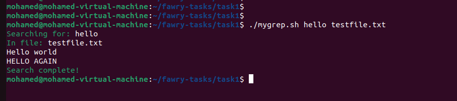
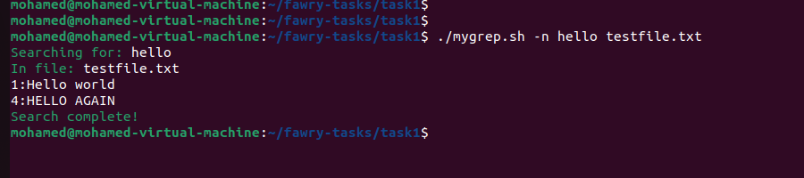
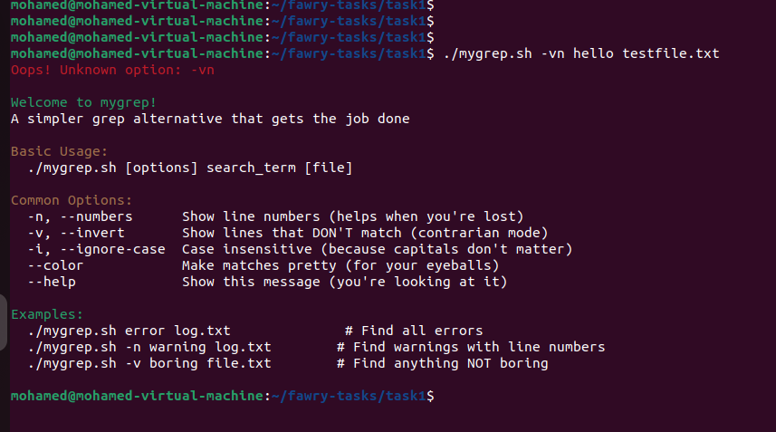
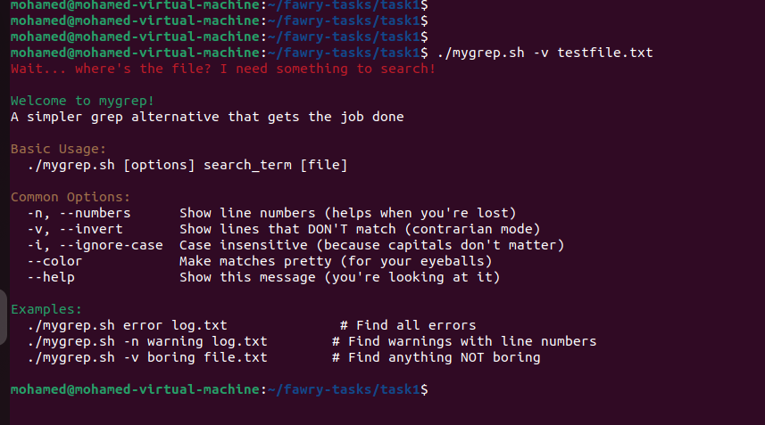
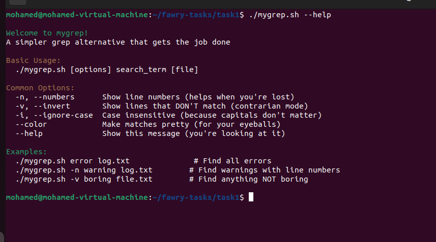
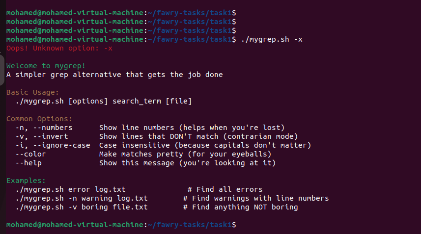

# mygrep.sh - Mini Grep Tool

A simplified, case-insensitive grep clone written in Bash.

## Task Requirements Met
- **Case-insensitive search** ("hello" matches "HELLO")
- **`-n`** shows line numbers
- **`-v`** inverts matches
- **Handles combinations** like `-vn` or `-nv`
- **Validates input** and shows errors for missing pattern or file
- **`--help`** flag displays usage information

## Usage
```bash
chmod +x mygrep.sh
./mygrep.sh [options] PATTERN FILE
```

## Options
| Short | Long         | Description                              |
|-------|--------------|------------------------------------------|
| `-n`  | `--numbers`  | Show line numbers                        |
| `-v`  | `--invert`   | Invert match results (show non-matching) |
| `-c`  | `--count`    | Print only count of matching lines       |
|       | `--color`    | Highlight matches in output              |
|       | `--help`     | Display this help message                |

## Examples
1. Basic Search
   ```bash
   ./mygrep.sh hello testfile.txt
   ```
   Output:
   ```
   Hello world
   HELLO AGAIN
   ```

2. With Line Numbers
   ```bash
   ./mygrep.sh -n hello testfile.txt
   ```
   Output:
   ```
   1: Hello world
   4: HELLO AGAIN
   ```

3. Inverted Match + Numbers
   ```bash
   ./mygrep.sh -vn hello testfile.txt
   ```
   Output:
   ```
   2: This is a test
   3: another test line
   5: Don't match this line
   6: Testing one two three
   ```

4. Error Handling
   ```bash
   ./mygrep.sh -v testfile.txt
   ```
   Output:
   ```
   Error: Missing search string
   Usage: ./mygrep.sh [options] PATTERN FILE
   ```

## Project Structure
```
project/
├── mygrep.sh        # Main executable script
├── testfile.txt     # Sample data for testing
├── README.md        # Project documentation
└── screenshots/     # Example output snapshots
```

## Implementation Notes
- **Argument Parsing**: Uses Bash `getopts` for `-n`, `-v`, `-c`; manual check for long flags `--color` and `--help`.
- **Command Construction**: Builds `grep` command as an array (`cmd=(grep -i)`) for safe quoting, then invokes it.
- **Error Handling**: Detects missing pattern or file, unknown options, and non-existent files, printing usage when needed.
- **Extensibility**: To support regex or flags like `-l`, simply add them to the `getopts` logic and append to the command array.
- **Most Challenging Part**: Ensuring combined flags (e.g., `-vn`) work correctly and handling robust input validation.

## Screenshots
See the `screenshots/` directory for example outputs:
- `basic_search.png`

- `line_numbers.png`

- `inverted_match.png`

- `error_handling.png`


## Bonus
- Running `./mygrep.sh --help` displays a full usage guide.

- Unknown flags (e.g., `./mygrep.sh -x`) produce an error message and show help.


